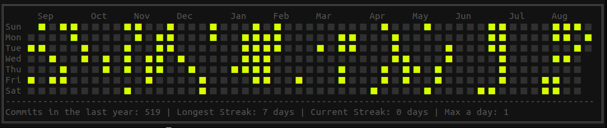

Let us assume that you have a set of dates. You want to display these dates in a readable clear way.

For example like this: 



So I have great info. It is required an hour of coding. It is one line of code, maybe two...

### In this article I will show how to generate an image like these. 

What do you need?

+ jq - great toll for json / text processing
+ node - js interpreter
+ awk - text processor for selecting data

### Preparing file with dates

We want to prepare a file with dates like these

```csv
2019-08-13
2018-05-19
2018-06-22
2019-04-16
```

Allow us to assume that you need to show dates of creation of files in your folder with photos. You can do it using the command

```bash
ls -l --time-style=long-iso images | awk '{print $6}' | sort > local/dates.csv
```

Option `--time-style` allows showing dates in easy to the processing format. Next `awk` selects column with dates and sorted dates are saved in temporary file  `/tmp/dates.csv` .

### Displaying git styled calendar

Now if you want to display these dates you need to type

```bash
cli-gh-cal --data "$(jq -R '[inputs | [.,1] ]' < /tmp/dates.csv)"
```

In this case, we put to work `jq` - powerfull templater for json files. It allows replacing the list of dates to json string required by `cli-gh-cal`. After executing this command you should see an image similar to presented at the beginning.

### Required packages

To work there have to be installed `node`. I recommend installing it with `nvm` on the local machine.

> [https://www.digitalocean.com/community/tutorials/how-to-install-node-js-on-ubuntu-18-04](https://www.digitalocean.com/community/tutorials/how-to-install-node-js-on-ubuntu-18-04)

Next package - `cli-gh-cal` can be installed by `npm` - node pacakges manager

> [https://github.com/IonicaBizau/cli-gh-cal](https://github.com/IonicaBizau/cli-gh-cal)

Finally, you need also `jq`

> [https://stedolan.github.io/jq/download/](https://stedolan.github.io/jq/download/)

I hope this article inspired you. For me, it is a great example of how a small amount of code is needed to achieve great-looking results in data visualization today. Wow! 